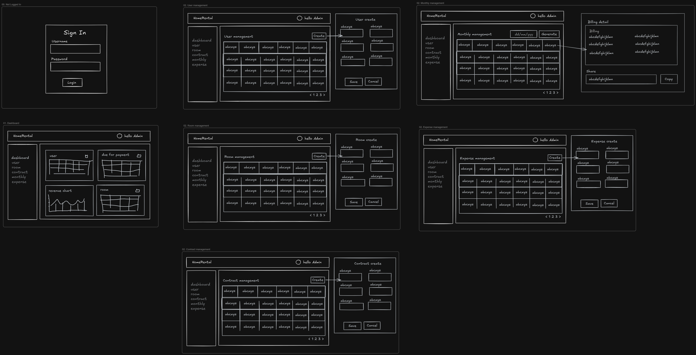

# Screens

## Danh sách màn hình đã implement

| Route | Component | Mô tả |
|---|---|---|
| `/login` | Login.vue | Trang đăng nhập |
| `/dashboard` | Dashboard.vue | Tổng quan: hóa đơn đến hạn/quá hạn, biểu đồ doanh thu/chi phí, danh sách phòng |
| `/rooms` | Rooms.vue | Quản lý phòng (CRUD) |
| `/users` | Users.vue | Quản lý người thuê (CRUD) |
| `/contracts` | Contracts.vue | Quản lý hợp đồng (CRUD) + in/xem mẫu hợp đồng |
| `/monthly-billing` | MonthlyBilling.vue | Quản lý hóa đơn tháng: generate, nhập số điện, share link, in phiếu thu |
| `/expenses` | Expenses.vue | Quản lý chi phí (CRUD) |
| `/settings` | Settings.vue | Cài đặt: tài khoản thanh toán (QR), mẫu hợp đồng WYSIWYG |
| `/shared-billing/:token` | SharedBilling.vue | Xem hóa đơn public (không cần đăng nhập) |
| `/sign-contract/:token` | SignContract.vue | Ký hợp đồng điện tử public: xem hợp đồng, vẽ/tải chữ ký người thuê (không cần đăng nhập) |

## Shared/Reusable Components

| Component | Mô tả |
|---|---|
| AppLayout.vue | Layout chung (sidebar + content wrapper) |
| DatePicker.vue | Date input theo format dd-mm-yyyy |
| MoneyInput.vue | Input tiền tự động format phần nghìn |
| RichTextEditor.vue | WYSIWYG editor (soạn mẫu hợp đồng) |
